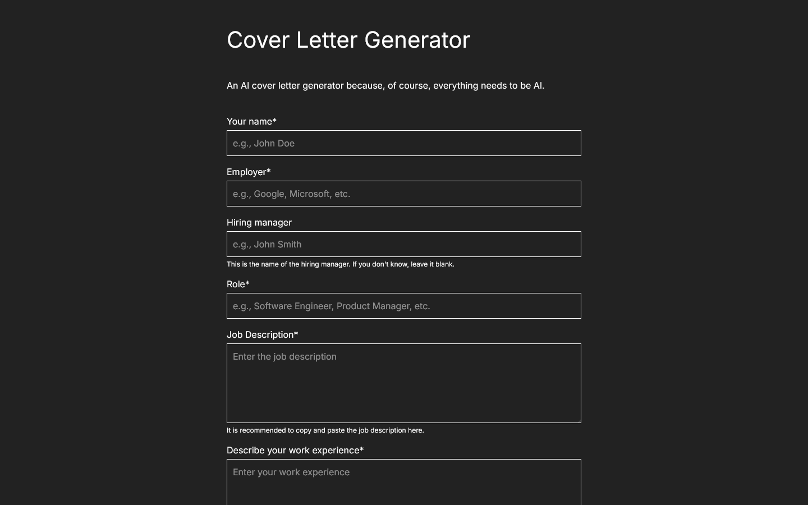

## What Is the *AI cover letter generator*?

I wanted to work on a project that would allow me to experiment with AI models and their capabilities. I also wanted to 
create something that would be useful to people, so I created an AI-powered cover letter generator that speeds up the monotonous
process of writing cover letters. The app uses Google GenAI to generate personalized cover letters based on user input,
making it easier for job-seekers to create tailored applications for their desired positions. The app is built with Next.js
15 and is fully responsive, ensuring a seamless experience across devices.

## Why Google GenAI?

Admittedly, I chose Google GenAI because of its generous free tier. I wanted to experiment with AI models and their capabilities,
and Google GenAI provided a great opportunity to do so without incurring costs. The API is easy to use and integrates well
with Next.js, making it a perfect fit for this project.

I used Vercel's AI SDK to integrate Google GenAI into the app. The SDK simplifies the process of making API calls and handling
streamed responses.

## Challenges

1. Preventing prompt injection attacks can be challenging, especially when using AI models that generate text based on user
   input. I implemented some basic prompt engineering techniques to mitigate this risk, but it's an ongoing concern.
2. Ensuring the generated cover letters are relevant and tailored to the user's input can be difficult, as AI models may
   produce generic or unrelated content. I focused on providing clear instructions and examples to guide the model.