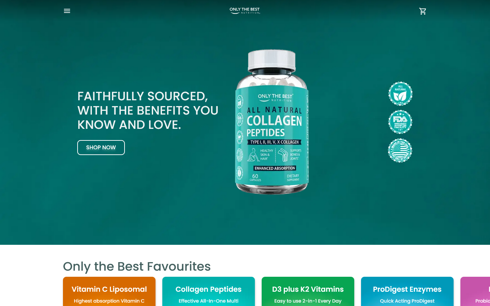

## What Is *Only The Best Nutrition*?

*Only The Best Nutrition* is an online store that sells supplements. Built using **[Next.js 13](https://nextjs.org/)**, customizable through **[Netlify CMS](https://decapcms.org/)** (now Decap CMS), **[Stripe](https://stripe.com/en-ca)** for payment processing, and implements **[Google Analytics](https://marketingplatform.google.com/about/analytics/)** for user behaviour tracking, *Only The Best Nutrition* offers a performant, hassle-free shopping experience to customers and simple product and site customization for the client.

## My Role

*Only The Best Nutrition* was my first professional greenfield project. I was responsible for developing the UI, which was built on top of **[Material UI](https://mui.com/material-ui/)**, implementing business logic (including cart and checkout logic), search engine optimization, performance optimization, user tracking, and headless CMS integration. The site leverages Next.js's **[static site generation (SSG)](https://nextjs.org/docs/pages/building-your-application/rendering/static-site-generation)** to serve performant web pages, Vercel's **[serverless runtime](https://vercel.com/docs/functions/runtimes#node.js)** for hosting API routes, and Vercel's **[edge runtime](https://vercel.com/docs/functions/runtimes/edge-runtime)** to seamless handling of middleware requests which involve rewrites and redirects. Along with being performant, the site was implemented with a mobile-first strategy, and is fully responsive.

As a team, we decided Netlify CMS would be the ideal headless CMS due to its simple user interface and straightforward SSG implementation. Access to all entries of a collection statically within the repo made page generation at build time simple to implement. In addition to integrating a headless CMS into the site, I was responsible for designing the schemas outlining each collection. The CMS allowed our client to:
- Edit product theme colours, name, pricing, and page content
- Edit the homepage layout
- Write blog posts
- Create and customize offers
- Customize pages
- Define rewrites and redirects