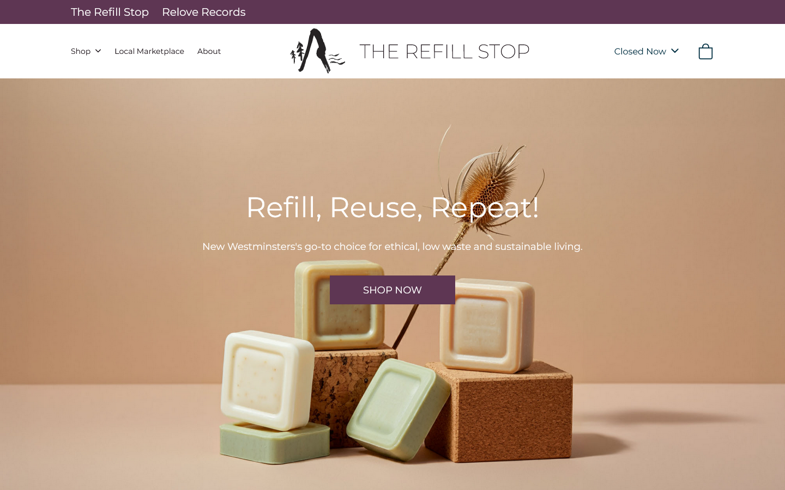

## What Is *The Refill Stop*?

*The Refill Stop* is the online store of a refillery based in New Westminster, BC. Built using **[Astro](https://astro.build/)**, customizable through a customized CMS based on **[FireCMS](https://firecms.co/)**, **[Stripe](https://stripe.com/en-ca)** for payment processing, and implements **[Google Analytics](https://marketingplatform.google.com/about/analytics/)** for user behaviour tracking, *The Refill Stop* offers a performant, hassle-free shopping experience to customers and simple product and site customization for the client.

## My Role

*The Refill Stop* was my first professional "full stack" project. I customized and added new features to the existing FireCMS library according to the needs of the stakeholders. I also developed a private npm package, hosted on **[Google Artifact Registry](https://cloud.google.com/artifact-registry/docs)**, that interacts with data in the CMS on the site. The website's UI began development through another developer. Once I took over their work, I integrated the CMS, implemented forms, including the checkout form, using **[React Hook Forms](https://react-hook-form.com/)**, and payment processing using **[Stripe Elements](https://stripe.com/en-ca/payments/elements)**. Astro API routes were also implemented to act as a proxy to our company's backend. Data in forms (such as the checkout form) and 
endpoint requests were validated using **[zod](https://zod.dev/)**.

The CMS allowed our client to:
- Edit product name, pricing, and page content
- Edit the homepage layout
- Write blog posts
- Create and customize offers
- Create custom pages