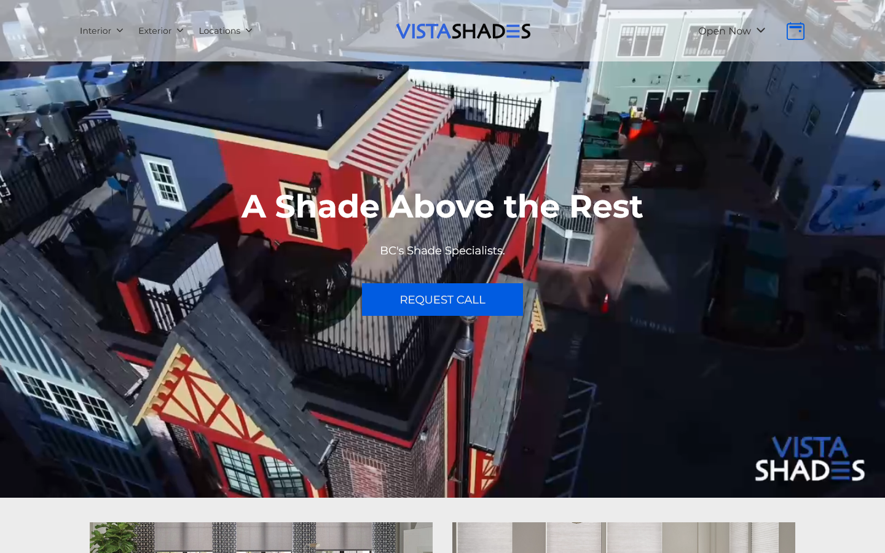
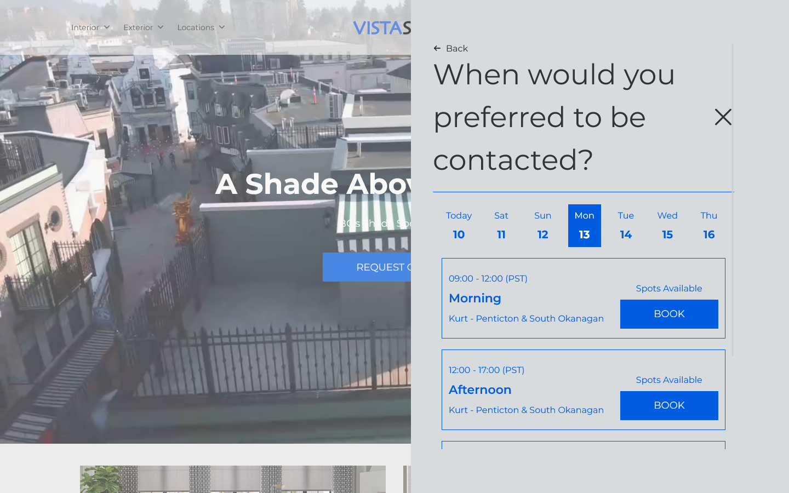

## What Is *VistaShades*?

*VistaShades* is the company site of a window blinds and shades business based in British Columbia. Built using **[Astro](https://astro.build/)**, customizable through a customized CMS based on **[FireCMS](https://firecms.co/)** and implements **[Google Analytics](https://marketingplatform.google.com/about/analytics/)** for user behaviour tracking, *VistaShades* offers a performant, hassle-free browsing experience to customers and simple blog and site customization for the client.

## My Role

*VistaShades* was the first client of ours to use our custom booking service to its fullest extent. I customized and added new features to the existing FireCMS library according to the needs of the stakeholders. I also developed a private npm package, hosted on **[Google Artifact Registry](https://cloud.google.com/artifact-registry/docs)**, that interacts with data in the CMS on the site. The website's UI began development through another developer. Once I took over their work, I integrated the CMS and implemented forms, including the booking and checkout forms, using **[React Hook Forms](https://react-hook-form.com/)**. Astro API routes were also implemented to act as a proxy to our company's backend. Data in forms (such as the booking and checkout forms) and 
endpoint requests were validated using **[zod](https://zod.dev/)**.

The CMS allowed our client to:
- Edit product name, pricing, and page content
- Edit the homepage layout
- Write blog posts
- Create and customize offers
- Create custom pages

The site's booking feature is the UI implementation of our custom booking service. Although the UI implements our backend's API, I was tasked with implementing features that were missing such as handling appointment collisions and definition of booking time slots. I used [Day.js](https://day.js.org/) to simplify these tasks. 

Many mistakes were made and lessons were learned through this booking service project. One lesson learned was that testing, both manual and automatic, is imperative to a successful release. While I had conducted what I thought was exhaustive manual testing, I still missed many edge cases such as start-of-day and end-of-day appointments, daylight savings, and timestamp and timezone discrepancies.
